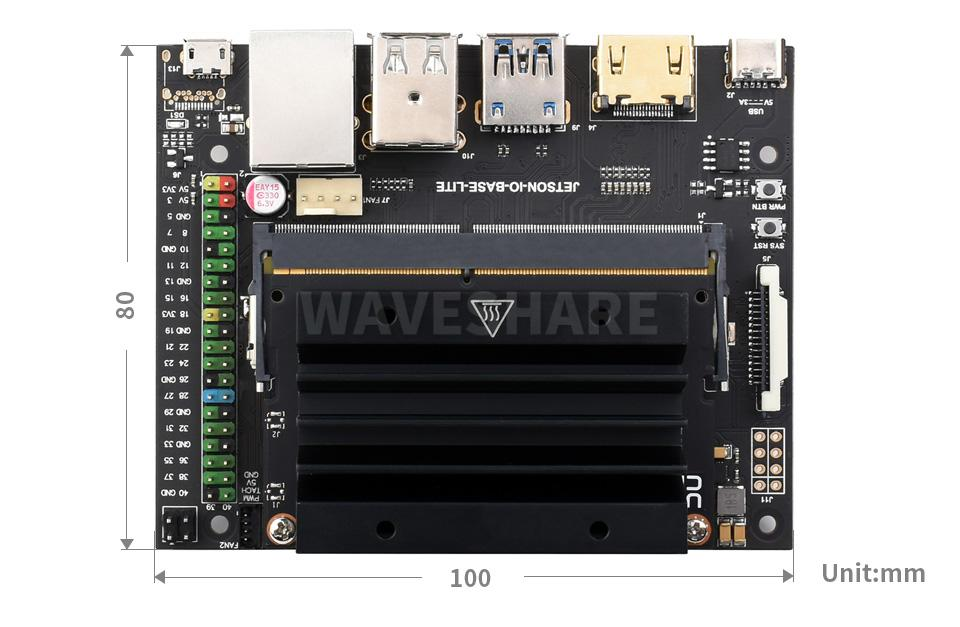
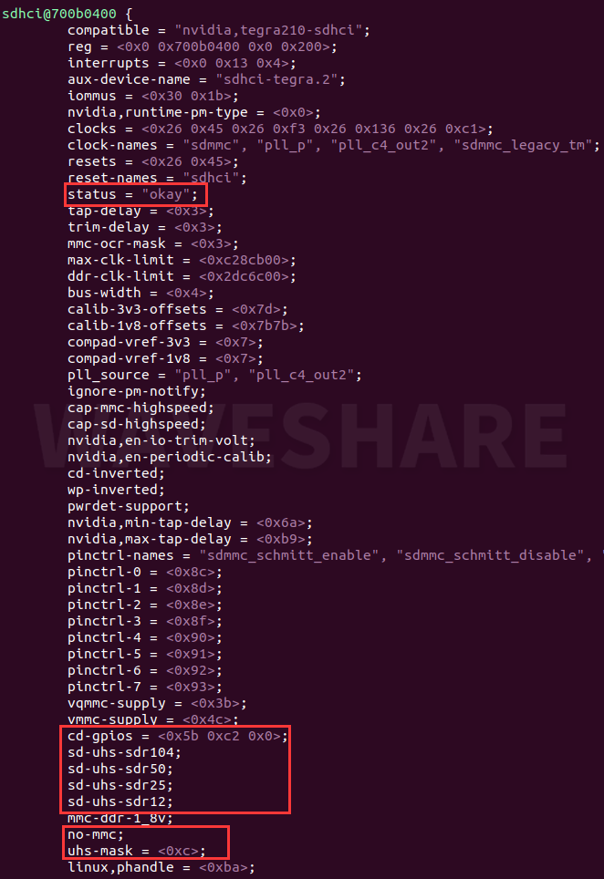

# Jetson Nano 微雪定制版

这是一款微雪生产的Jetson Nano开发套件，载板由微雪自行生产，如图所示。


这款Jetson Nano使用的是eMMC作为存储颗粒，微雪定制版载板为其提供了SD卡扩展卡。

由于采用了定制版载板，所以使用官方SDKManager烧录后并不能正常加载该SD卡设备，需要对设备树进行修改。

详见：<https://www.waveshare.net/wiki/JETSON-NANO-DEV-KIT>

## 反编译DTS源

### 1. 在Ubuntu PC机安装DTC软件

```shell
sudo apt-get install device-tree-compiler
```

### 2. 进入HW Imager内核路径下，反编译dts源文件

```shell
# 针对不同jetpack，修改对应路径
cd ~/nvidia/nvidia_sdk/JetPack_4.6_Linux_JETSON_NANO_TARGETS/Linux_for_Tegra/kernel/dtb 
sudo dtc -I dtb -O dts -o tegra210-p3448-0002-p3449-0000-b00.dts tegra210-p3448-0002-p3449-0000-b00.dtb
```

### 3. 修改设备树

```shell
sudo vim tegra210-p3448-0002-p3449-0000-b00.dts
```

### 4. 找到sdhci@700b0400部分，将status = "disable"改成okay，下面添加TF信息

```txt
cd-gpios = <0x5b 0xc2 0x0>;
sd-uhs-sdr104;
sd-uhs-sdr50;
sd-uhs-sdr25;
sd-uhs-sdr12;
            
no-mmc;
uhs-mask = <0xc>;
```

参考下图



### 5. 编译dtb文件

```shell
dtc -I dts -O dtb -o tegra210-p3448-0002-p3449-0000-b00.dtb tegra210-p3448-0002-p3449-0000-b00.dts
```

### 6. 替换驱动文件

获得`tegra210-p3448-0002-p3449-0000-b00.dtb`后，即可使用命令行进行烧录。

以JetPack 4.6.6为例，切换到对应目录，并执行烧录动作。

```sehll
cd ~/nvidia/nvidia_sdk/JetPack_4.6.6_Linux_JETSON_NANO_TARGETS/Linux_for_Tegra
sudo ./flash.sh jetson-nano-emmc mmcblk0p1
```

或者，按照常规方式使用SDKManager进行烧录后，替换`tegra210-p3448-0002-p3449-0000-b00.dtb`文件。

