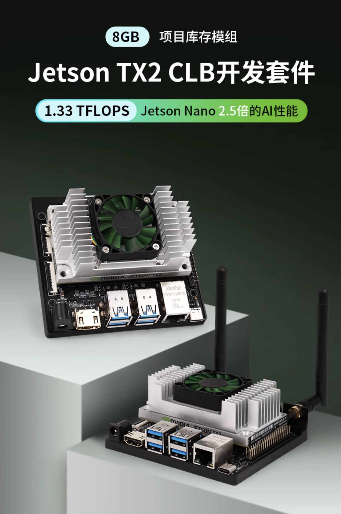
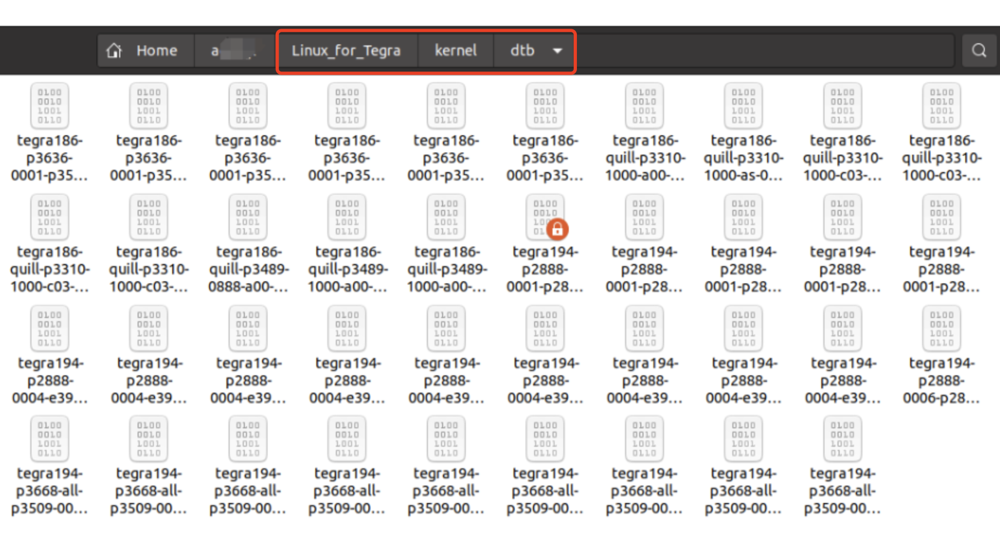

# Jetson TX2 创乐博定制版

这是一款创乐博生产的Jetson TX2 CLB开发套件，载板由创乐博自行生产，如图所示。


由于采用了定制版载板，所以使用官方SDKManager烧录时无法正常加载硬件（如USB设备），会导致烧录失败。

因此，在烧录设备前需要将创乐博的设备驱动替换官方驱动，并使用命令进行烧录。

## 替换驱动

按照常规步骤，将Jetson TX2设备设置为REC（Recover）模式后开机，并将Jetson TX2设备与Ubuntu PC机使用USB线连接。打开SDKManager，正常识别Jetson TX2设备后，选择Jetson OS File仅下载即可。这时可以在`~/nvidia`目录获得用于系统烧录的Jetson TX2目录。参考下图，找到dtb文件存储位置。



将`tegra186-quil-p3310-1000-c03-00-base.dtb`直接替换至当前位置，然后在终端使用如下命令烧录。

```sehll
cd ~/nvidia/Linux_for_Tegra
sudo ./flash.sh jetson-tx2 mmcblk0p1
```

烧录完成后，Jetson TX2即可进入Ubuntu系统初始化桌面，这时USB设备可以被启用，刚才替换掉的文件就在这个位置。

``` txt
/boot/dtb/kernel_tegra186-quill-p3310-1000-c03-00-base.dtb
```

***注意：如果系统升级或其他情况导致该设备无法正常使用USB设备，这时可以通过SSH方式将其驱动直接覆盖至上述位置***

``` shell
scp kernel_tegra186-quill-p3310-1000-c03-00-base.dtb <username>@<Jetson-TX2-IP>:/boot/dtb/
```
